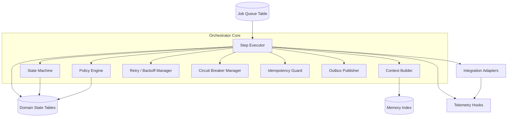

# C4 Component

```mermaid
flowchart TB
    subgraph Orchestrator Core
        sm[State Machine]
        exec[Step Executor]
        policy[Policy Engine]
        ctx[Context Builder]
        retry[Retry / Backoff Manager]
        cb[Circuit Breaker Manager]
        idm[Idempotency Guard]
        outbox[Outbox Publisher]
    end

    jobs[(Job Queue Table)]
    state[(Domain State Tables)]
    mem[(Memory Index)]
    adapters[Integration Adapters]
    obs[Telemetry Hooks]

    jobs --> exec
    exec --> sm
    exec --> policy
    exec --> ctx
    exec --> retry
    exec --> cb
    exec --> idm
    ctx --> mem
    exec --> adapters
    exec --> state
    exec --> outbox
    sm --> state
    policy --> state
    exec --> obs
    adapters --> obs
```

Диаграмма показывает внутреннее устройство ядра: управление переходами, безопасным execution
и деградацией внешних зависимостей.
