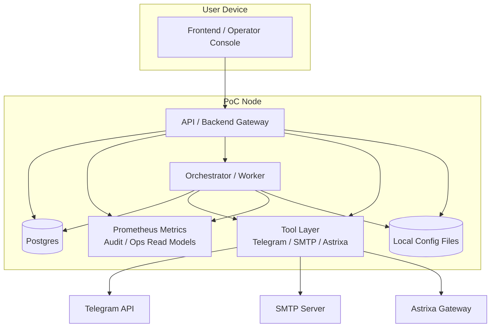

# C4 Container

```mermaid
flowchart TB
    subgraph User Device
        ui[Frontend / Operator Console]
    end

    subgraph PoC Node
        api[API / Backend Gateway]
        worker[Orchestrator / Worker]
        tools[Tool Layer\nTelegram / SMTP / Astrixa]
        db[(Postgres)]
        cfg[(Local Config Files)]
        obs[Prometheus Metrics\nAudit / Ops Read Models]
    end

    tg[Telegram API]
    smtp[SMTP Server]
    astrixa[Astrixa Gateway]

    ui --> api
    api --> db
    api --> obs
    api --> worker
    worker --> db
    worker --> tools
    worker --> obs
    api --> tools
    api --> cfg
    worker --> cfg
    tools --> tg
    tools --> smtp
    tools --> astrixa
```

Диаграмма разделяет control plane, execution plane, integrations и persistent state.
