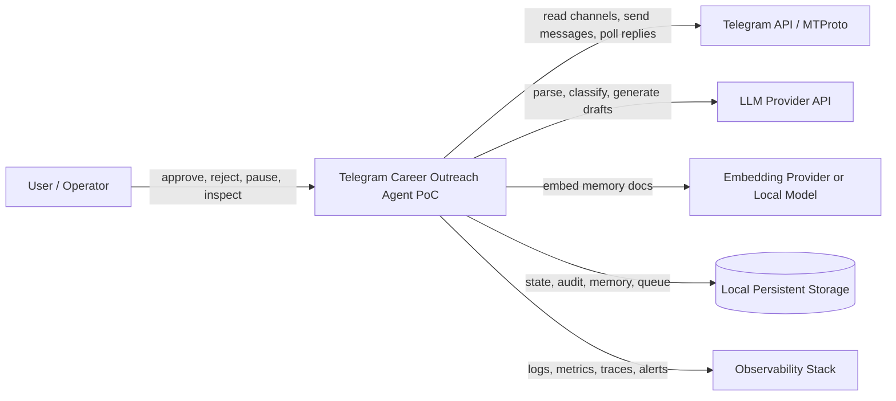

# C4 Context

```mermaid
flowchart LR
    user[User / Operator]
    system[Telegram Career Outreach Agent PoC]
    telegram[Telegram API / MTProto]
    llm[LLM Provider API]
    embed[Embedding Provider or Local Model]
    storage[(Local Persistent Storage)]
    obs[Observability Stack]

    user -->|approve, reject, pause, inspect| system
    system -->|read channels, send messages, poll replies| telegram
    system -->|parse, classify, generate drafts| llm
    system -->|embed memory docs| embed
    system -->|state, audit, memory, queue| storage
    system -->|logs, metrics, traces, alerts| obs
```

Диаграмма показывает внешние границы системы и то, что критичные side effects идут только
через контролируемые интеграционные адаптеры.
