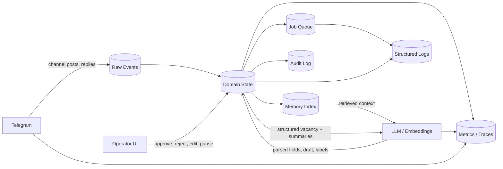

# Data Flow

```mermaid
flowchart LR
    tg[Telegram]
    llm[LLM / Embeddings]
    ui[Operator UI]

    raw[(Raw Events)]
    domain[(Domain State)]
    memory[(Memory Index)]
    queue[(Job Queue)]
    audit[(Audit Log)]
    logs[(Structured Logs)]
    metrics[(Metrics / Traces)]

    tg -->|channel posts, replies| raw
    raw --> domain
    domain --> queue
    memory -->|retrieved context| llm
    domain -->|structured vacancy + summaries| llm
    llm -->|parsed fields, draft, labels| domain
    domain --> memory
    ui -->|approve, reject, edit, pause| domain
    domain --> audit
    queue --> logs
    domain --> logs
    domain --> metrics
    llm --> metrics
    tg --> metrics
```

Диаграмма показывает, какие данные считаются source-of-truth, что индексируется,
а что уходит в логирование и telemetry.
