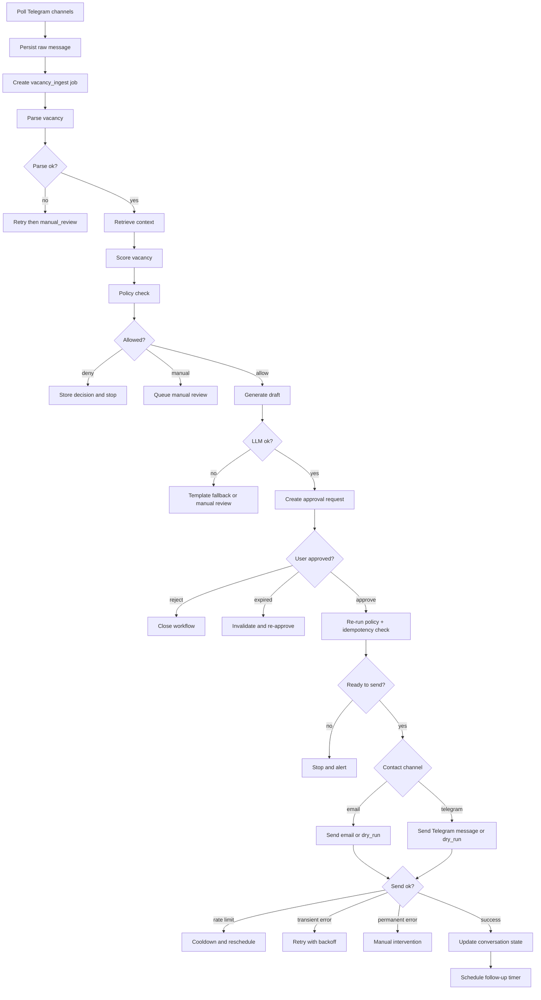

# Workflow / Execution Graph

```mermaid
flowchart TD
    A[Poll Telegram channels] --> B[Persist raw message]
    B --> C[Create vacancy_ingest job]
    C --> D[Parse vacancy]
    D --> E{Parse ok?}
    E -- no --> E1[Retry then manual_review]
    E -- yes --> F[Retrieve context]
    F --> G[Score vacancy]
    G --> H[Policy check]
    H --> I{Allowed?}
    I -- deny --> I1[Store decision and stop]
    I -- manual --> I2[Queue manual review]
    I -- allow --> J[Generate draft]
    J --> K{LLM ok?}
    K -- no --> K1[Template fallback or manual review]
    K -- yes --> L[Create approval request]
    L --> M{User approved?}
    M -- reject --> M1[Close workflow]
    M -- expired --> M2[Invalidate and re-approve]
    M -- approve --> N[Re-run policy + idempotency check]
    N --> O{Ready to send?}
    O -- no --> O1[Stop and alert]
    O -- yes --> P{Contact channel}
    P -- email --> P1[Send email or dry_run]
    P -- telegram --> P2[Send Telegram message or dry_run]
    P1 --> Q{Send ok?}
    P2 --> Q{Send ok?}
    Q -- rate limit --> Q1[Cooldown and reschedule]
    Q -- transient error --> Q2[Retry with backoff]
    Q -- permanent error --> Q3[Manual intervention]
    Q -- success --> R[Update conversation state]
    R --> S[Schedule follow-up timer]
```

Диаграмма отражает не только happy path, но и ветки деградации, которые критичны для
инфраструктурного трека.
